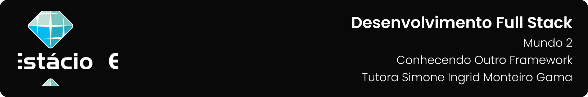

---

[Projeto](#-projeto) • [Como baixar e executar](#-como-baixar-e-executar) • [Procedimentos](#-procedimentos) • [Tecnologias utilizadas](#-tecnologias-utilizadas) • [Autor](#-autor) • [Licença](#-licença)

---

## 📋 Projeto

Missão Prática com o objetivo de implementar front-end web com base no framework Angular, utilizando serviços e componentes na sintaxe TypeScript apresentada no **`Nível 4: Conhecendo Outro Framework`** do **`Mundo 2`** do curso de **`Desenvolvimento Full Stack`** da **`Estácio`**, do semestre de **`2023.2`**, sob a tutoria de Simone Ingrid Monteiro Gama.

Projeto elaborado de acordo com as diretrizes especificadas para a Missão Prática, que podem ser conferidas [**`clicando aqui`**](https://sway.office.com/s/FsURgWIC7pni5Tll/embed).

## 📥 Como baixar e executar

Para baixar os arquivos deste repositório, você deve ter o [GitHub](https://github.com/) instalado em seu dispositivo.

Após instalado, você deverá acessar a guia `Arquivo` → `Clonar repositório` → `URL` e incluir o caminho `guedesert/conhecendo-outro-framework`.

Além disso, é interessante que você tenha um bom editor para trabalhar com os códigos, dos quais eu recomendo o uso do, [Visual Studio Code](https://code.visualstudio.com/).

## 🔗 Procedimentos

Durante o projeto foram desenvolvidos 03 procedimentos descritos abaixo:

<table>
  <tr>
    <th>Procedimento</th>
    <th>Descrição</th>
  </tr>
  <tr>
    <td>1º procedimento</td>
    <td>
      <ul>
        <li>Configure um projeto Angular usando Angular CLI.</li>
        <li>Crie classes "Livro" e "Editora."</li>
        <li>Crie controladores de editoras e livros como serviços Angular.</li>
        <li>Crie componentes "LivroLista" e "LivroDados".</li>
        <li>Codifique as entidades "Editora" e "Livro."</li>
        <li>Configure injeção de dependência no AppModule.</li>
        <li>Implemente a lógica e o template para o componente "LivroLista."</li>
        <li> Atualize o template de AppComponent.</li>
      </ul>
    </td>
  </tr>
  <tr>
    <td>2º procedimento</td>
    <td>
      <ul>
        <li>Configure o FormsModule no AppModule.</li>
        <li>Configure o roteamento no arquivo app-routing.module.ts.</li>
        <li>Modifique o template de AppComponent para um menu de navegação.</li>
        <li>Implemente a lógica e o template para o componente "LivroDados."</li>
      </ul>
    </td>
  </tr>
</table>

## 🛠 Tecnologias utilizadas

Para a construção e execução do projeto foram utilizadas as seguintes tecnologias:

 

## 👥 Autor

| Aluno                                                  | Matrícula    | E-mail                                      |
| ------------------------------------------------------ | ------------ | ------------------------------------------- |
| [Emanuel Roseira Guedes](https://github.com/guedesert) | 202212181407 | [📧](mailto:202212181407@alunos.estacio.br) |

## 📃 Licença

Este repositório está licensiado sob a [Licença MIT](./LICENSE).

